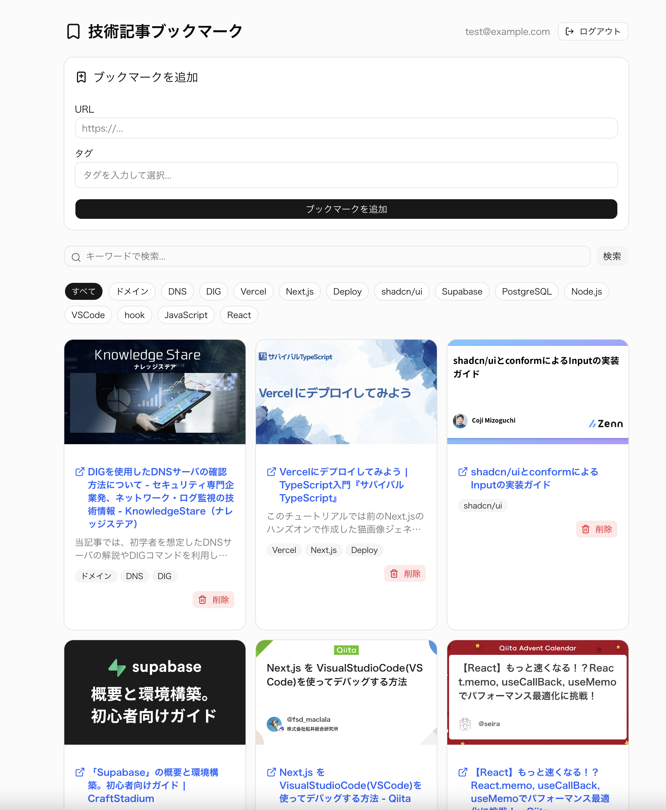

# 1. このアプリについて

## 技術記事ブックマークアプリ (Next.js + Supabase)

認証機能と行レベルセキュリティ(RLS)を備えた、自分専用のブックマーク管理ツール(Webアプリ)です。



---

<br>

# 2. デモ

https://bookmarkapp.kanda-software-labo.com/
<br>
(テスト用アカウント: test@example.com / stockholm1912)

---

<br>

# 3. 主な機能

- ユーザ登録・ログイン機能 (Supabase Auth)
- ブックマークの登録・一覧表示・削除: URLを入力するだけでブックマークを登録できる
- 自動メタデータ取得:
  - Next.jsの Route Handlersを使用し、サーバーサイドでcheerioを用いてURLからOGP情報を抽出
  - サーバサイドでAPI実行することで、CORS制約を回避しつつ、セキュアにデータを取得・保存する仕組みを構築
- タグ付け機能: ブックマークごとに「Java」「React」「アルゴリズム」などのタグを付けて登録できる
- 堅牢なデータ保護 (Row Level Security)

### メタデータ取得対象

- HTMLのOGP情報("og:title", "og:description", "og:image")
- HTMLのメタ情報("title", "description")

---

<br>

# 4. 使用方法

## ■ ログイン / アカウント登録

- アカウントを登録している場合は、ログイン画面からログインしてください。
- アカウントは、**2. デモ**に記載しているテスト用アカウントが使用可能です。
- アカウントを登録する場合は、ログイン画面の「新規登録」からアカウント登録が可能です。

## ■ ブックマーク登録

- URLとタグを入力し、「ブックマークを追加」ボタンを押下して、ブックマークを登録できます。

## ■ タグ登録

- タグはテキストボックスにタグを入力し、下に表示されるドロップダウンから対象をクリックするか、Enterキーを押下することで、バッジ表示されます。
- ドロップダウンは上下矢印キーで移動可能で、ESCキーで表示を消すことが可能です。
- バッジ表示されたタグのみが登録対象となりますので、注意ください。

## ■ 登録内容カード表示

- 登録したブックマークは画面下側にカードとして表示されます。
- メタデータから取得した画像、URLのリンク、概要、タグを表示します。
- カード内の「削除」ボタンからカードの削除が可能です。

## ■ キーワード検索

- 登録したブックマークの上にあるテキストボックスに任意のキーワードを指定して、ブックマークの検索が可能です。
- 検索は、メタデータの"title", "description"に指定した文字列が部分一致するブックマークを取り出して表示します。

## ■ タグによるフィルタリング

- 登録したブックマークの上にあるタグのバッジをクリックすると、タグで表示するブックマークをフィルタリングすることが可能です。

## ■ ログアウト

- トップページの「ログアウト」ボタンからログアウトができます。

---

<br>

# 5. 使用技術 / Tech Stack

本プロジェクトでは、スケーラビリティと開発効率を重視し、以下のモダンな技術を採用しています。

- **フロントエンド**: Next.js 16 (React 19, App Router), TypeScript
- **スタイリング/UI**: Tailwind CSS, shadcn/ui
- **バックエンド/DB**: Next.js 16, Supabase (PostgreSQL, Auth, Row Level Security)
- **デプロイ**: Vercel
- **AI**: Claude Code

---

<br>

# 6. 設計のポイント

- App Routerを活用したサーバーサイドレンダリングとデータ取得の最適化
- SupabaseのRLS(行単位セキュリティ)を用いたマルチテナント型セキュリティ設計
- Next.jsのServer ComponentsとClient Componentsの適切な分離によるパフォーマンス最適化
- TypeScriptによる厳密な型定義
- レスポンシブデザインに対応

---

<br>

# 7. ディレクトリ構造

```
src/
├── app/
│   ├── api/
│   │   ├── bookmarks/
│   │   │   └── route.ts   # ブックマークの一覧取得・登録・削除を行う Route Handler
│   │   └── ogp/
│   │       └── route.ts   # URLからOGP情報（タイトル・概要・画像）をスクレイピングする Route Handler
│   ├── login/
│   │   └── page.tsx       # ログインページ（メール・パスワード入力フォーム）
│   ├── signup/
│   │   └── page.tsx       # アカウント登録ページ
│   ├── globals.css        # グローバルCSS（Tailwind設定・カラー変数・フォント指定）
│   ├── layout.tsx         # アプリ全体のレイアウト（フォント・Toaster配置）
│   └── page.tsx           # トップページ（Server Component、ブックマーク一覧をSSRで取得）
├── components/
│   ├── ui/                # shadcn/ui の自動生成コンポーネント群
│   ├── BookmarkCard.tsx   # ブックマーク1件を表示するカード（削除ボタン・AlertDialog含む）
│   ├── BookmarkClient.tsx # ブックマーク画面全体の状態管理を担う Client Component
│   ├── BookmarkForm.tsx   # URL・タグ入力フォーム（ブックマーク登録）
│   ├── LogoutButton.tsx   # ログアウトボタン（Client Component）
│   ├── SearchBar.tsx      # キーワード検索バー
│   ├── TagFilter.tsx      # タグによるフィルタリング UI
│   └── TagInput.tsx       # オートコンプリート付きタグ入力コンポーネント
├── lib/
│   ├── supabase/
│   │   ├── client.ts      # ブラウザ用 Supabase クライアントの生成
│   │   └── server.ts      # サーバーサイド用 Supabase クライアントの生成（Cookie対応）
│   └── utils.ts           # Tailwind クラス結合ユーティリティ（cn関数）
├── proxy.ts               # セッション管理・未認証ユーザーのリダイレクト（Next.js 16 Proxy）
└── types/
    └── index.ts           # アプリ全体で使用する型定義（Bookmark・Tag等）
```

---

<br>

# 8. その他

### ユーザ認証について

- 本アプリはあえてメール認証を行わない設定としています。利便性とリソース管理の観点から、本デモ環境ではメールによる本人確認ステップを省略し、即座に機能を試せる構成としています。
